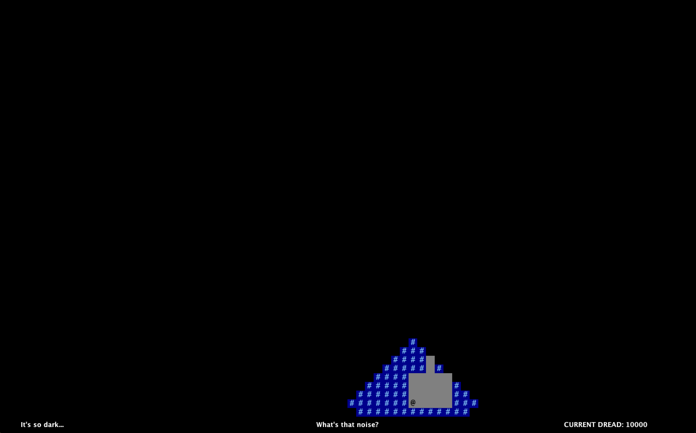
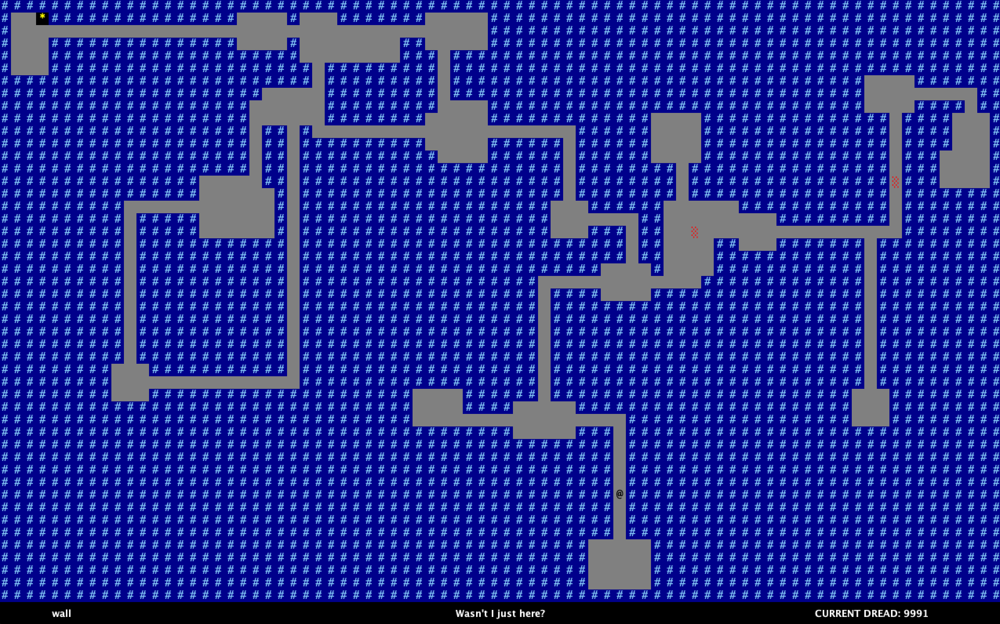

# Labyrinthian

Labyrinthian is a 2D game in Java, originally coded for CS61BL Summer 2022 (Data Structures and Programming Methodology) by Ethan Cheong and Diane Au.

The original spec for the project can be found [here](https://cs61bl.org/su22/projects/byow/). We were provided with a tile generation and hashing engine, and given a spec with broad requirements, tasked with designing a game that supported Pseudo-Random world generation, exploration and saving persistent game states. We chose to include additional features such as roaming enemy characters that chase down the player, the ability to highlight enemy paths, the map being rendered with darkness (which is toggleable), and a difficulty setting. 

To beat the game, reach the exit (the '*' tile) without dying. The labyrinth is perilous and there are multiple ways you can die; we'll leave you to find that out for yourself.

## Features
### Randomized World Generation and Persistent Saves

When starting a new game, the player is prompted for a seed. Input a sequence of numbers followed by the 's' key to generate a world pseudo-randomly. 

Then, choose the difficulty level: difficulty will affect certain game parameters (such as the number of enemies)

The player character is represented by an '@'. '#' tiles are walls, and cannot be stepped on. Use the 'WASD' keys to move.

You can press ':s' at any time to save the current game state and exit. Upon reloading the game, you can continue where you left off by pressing 'L' in the main menu. Only one save state is supported.
### Darkness

While in the game, press ':l' to toggle darkness on and off. Darkness is on by default.

### Enemies
The red tiles represent enemies. When the player steps into the range of enemies, they will chase the player using a path-finding algorithm (Dijkstra's). You can visualize the planned path of each enemy by pressing ':p' in game.

### Help menu
Press ':h' to show a help menu.

